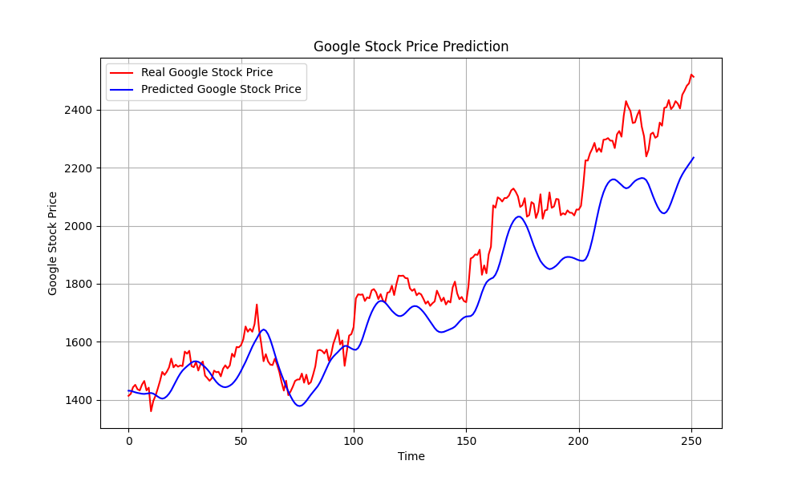

# Data Scientist/Machine Learning Engineer 

---

### PyTorch Classification for Cancer Diagnosis

Description: A PyTorch-based deep learning model for classifying cancerous and non-cancerous cells. It utilizes a neural network trained on medical imaging data.

---

### LSTM Model on Google Stock
This project implements a Long Short-Term Memory (LSTM) neural network to predict Google's stock prices. It involves data preprocessing, model training, and evaluation to forecast future stock trends.

*Figure 1: LSTM Prediction on Stock Market Data.*

---

## Time Series Analysis

Description: A comprehensive analysis of time series data using statistical and machine learning methods. It includes decomposition, forecasting, and anomaly detection techniques.

---

### Streamlit Data Visualization

Description: An interactive web application built with Streamlit for visualizing datasets. Users can upload data and create various plots dynamically.

[

---

### Contact

- 📧 [Email](m.helva34@gmail.com)
- 
- 
