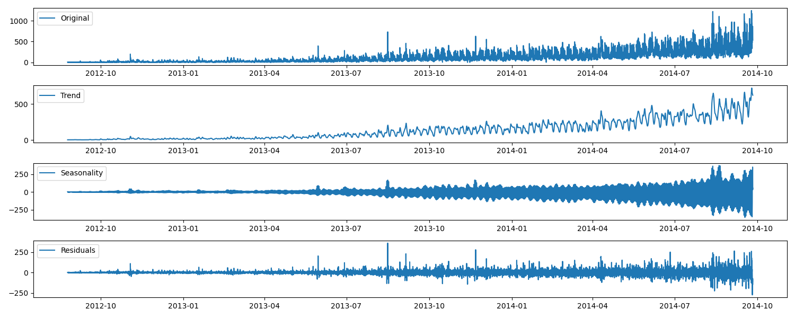

# Data Scientist/Machine Learning Engineer 

---

### PyTorch Classification for Cancer Diagnosis

Description: A PyTorch-based deep learning model for classifying cancerous and non-cancerous cells. It utilizes a neural network trained on medical imaging data.

---

### LSTM Model on Google Stock
This project implements a Long Short-Term Memory (LSTM) neural network to predict Google's stock prices. It involves data preprocessing, model training, and evaluation to forecast future stock trends.

<figure>
  
  <figcaption><strong>Figure 1<strong>: LSTM Prediction on Stock Market Data </figcaption>
</figure>

---

### Time Series Analysis

Description: A comprehensive analysis of time series data using statistical and machine learning methods. It includes decomposition, forecasting, and anomaly detection techniques.

<figure>
  
  <figcaption><strong>Figure 1<strong>: STL Decomposition of Time Series Data.</figcaption>
</figure>

---

### Streamlit Data Visualization

Description: An interactive web application built with Streamlit for visualizing datasets. Users can upload data and create various plots dynamically.

---

### 📫 Contact
- 📧 [Email](m.helva34@gmail.com)
- 🧑‍💼 [LinkedIn](https://www.linkedin.com/in/mehmet-helva-b2993a273/)
- 💻 [GitHub](https://github.com/mhelva)
