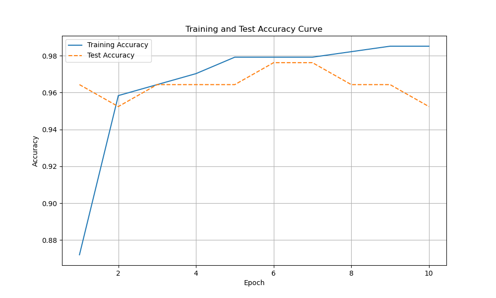
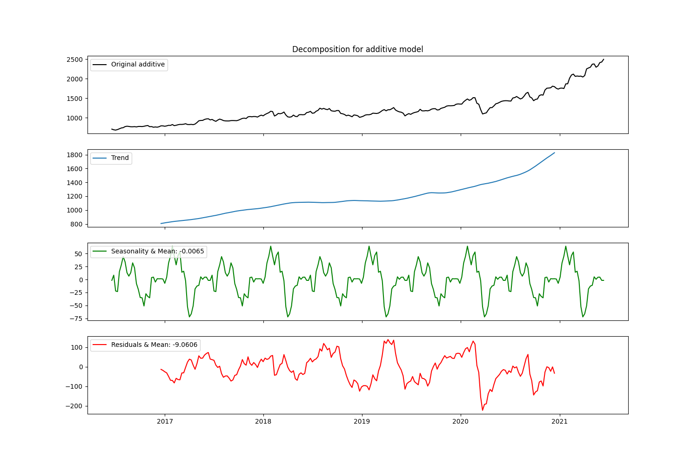
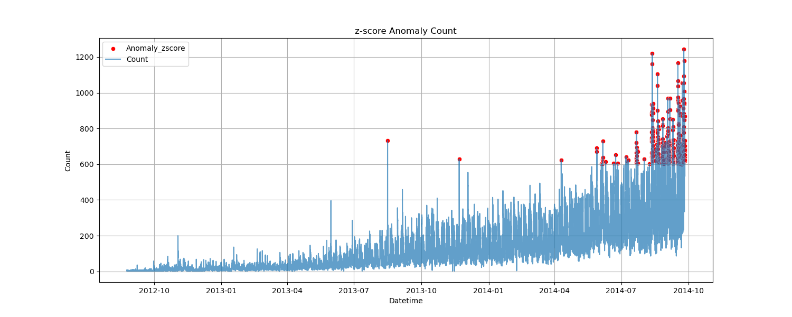
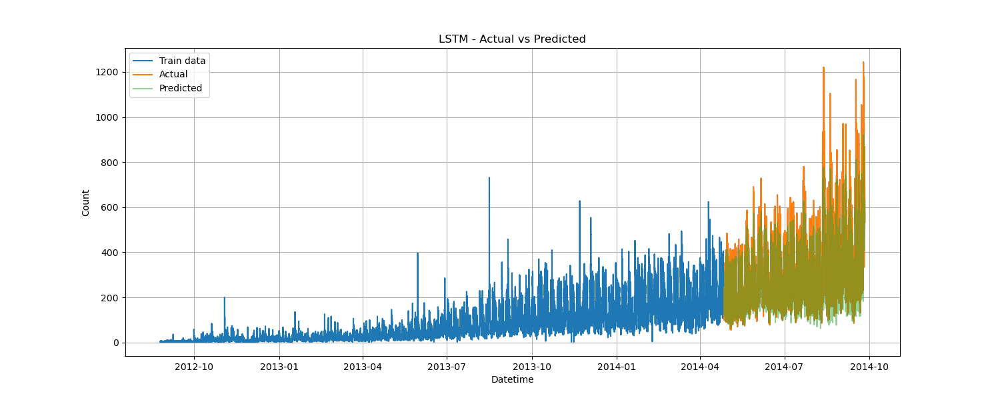

# Data Scientist/Machine Learning Engineer 

---
## Selected projects in data science, machine learning and NLP
---
### Breast Cancer Tumor Classification with PyTorch 

This project demonstrates a binary classification task using the Breast Cancer Wisconsin (Diagnostic) dataset. The objective is to classify tumors as either benign or malignant based on input features such as radius, texture, smoothness, and other cell characteristics. The model was built using PyTorch, showcasing its flexibility for deep learning workflows. A simple feedforward neural network was trained to distinguish between the two classes, and its performance was evaluated using accuracy, confusion matrix, and loss metrics. \
\

*Figure 1: Training and Test Accuracy Curve.*

---

### Google Stock Price Forecasting with LSTM
In this project, I implemented a Long Short-Term Memory (LSTM) neural network to forecast Google stock prices using historical data from 2016 to 2021. LSTM, a type of recurrent neural network (RNN), was chosen for its ability to model long-term dependencies in sequential data. The model effectively captured trends and temporal patterns in stock prices, demonstrating the power of deep learning in time series forecasting. \
\

*Figure 1: Decomposition of Google Stock.*

*Figure 2: LSTM Prediction on Google Stock Market Data.*

---

### Sensor Activity Forecasting with Machine Learning & Deep Learning
Forecasted sensor count over time using both classical machine learning algorithms and deep learning techniques. The goal was to model temporal patterns in sensor data and predict future sensor activity based on historical time series data, enabling better insights into trends, anomalies, and overall system behavior.\
\

*Figure 1: Anomaly Detection Using z-score*

*Figure 2: LSTM Prediction on Sensor Count.*

---

### CSV Visualizer Web App

Developed an interactive Streamlit web application that allows users to upload CSV files and instantly generate descriptive statistics and summaries, basic visualizations with multiple chart types: line, bar, histogram, scatter, pie. \
Hosted on [Streamlit Community Cloud](https://mhelva-datavisualization.streamlit.app/) \
\

---

### Contact

* 
* 
* 
